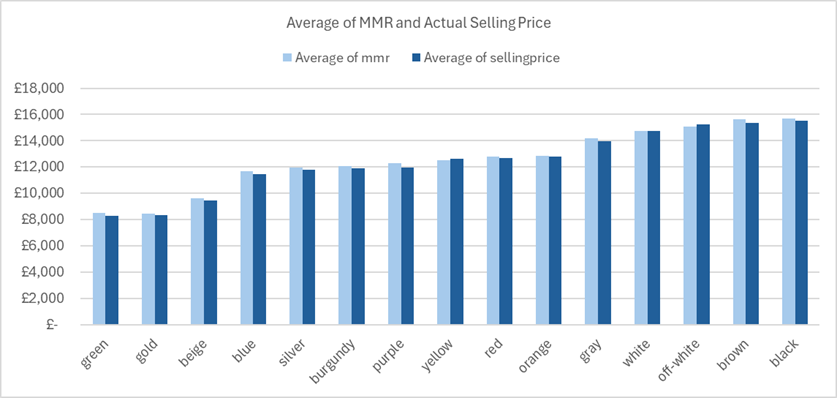
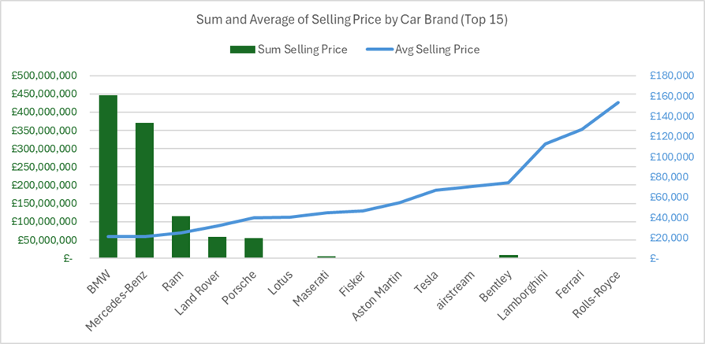

Welcome to my data science portfolio.

## 🤵 About Me

I currently work for a UK Financial Services company as a Data Analyst. My role mainly involves:
- Project managing data transformation projects.
- Analysing data to provide assurance that processes are followed and reporting analysis results to management.
- Creating dashboards to give others access to information and help them understand trends and insights.
<br>
<br>
<br>

## 🥇 My Skills

- **Tools**: Python, PowerBI, PowerQuery, Excel
- **Python Libraries**: Pandas, NumPy, matplotlib, seaborn
- **Technical skills**: Building Data Pipelines, Statistical Analysis, Data Visualisaition, Linear & Logistic Regression
- **General skills**: Project management, UK regulatory environment and rules.
- **Expierence**: 10 years expierence in the financial services across a variety of customer service and consultancy roles. And 3 years in a Data Analyst role.
I'm currently undertaking a Level 6 Data Science Apprenticeship to further enhance my skills.
<br>
<br>
<br>

## 💻 My Public Data Science Projects

I have one public project; a linear regression model to predict car price, in which I used python.
<br>
<br>
<br>
<br>
<br>
<br>

## 🚙 Project 1: Linear Regression to Predict Car Price

<br>

#### Executive Summary

People want to pay a car price that reflects the design and quality. This analysis discovers whether historical car sales data can predict the selling price. The hypothesis was that the condition and brand of a car would impact the price. Linear Regression was chosen as the appropriate model because it’s able to use numerical and encoded categorical data to predict a numerical continuous value.

Excel was initially used to explore and visualize the data, but issues quickly arose, such as the ability to encode columns, so the company switched to python, which is a better tool for reproducing results and placing a model into production.

The model’s results show that there is a ***reliable pattern between independent and dependent variables, and these are not due to randomness***. The model could be used now to predict car prices within a £4.5k tolerance. To enhance the model, another form of encoding could be used to remove possible overfitting. The model will save employees 26 hours a month that would be spent physically surveying cars and will limit underselling, potentially up to £2.9k per car, thereby generating more profit. 
<br>
<br>
<br>

#### Data Tools & Engineering

The data was sourced from Kaggle. Kaggle is not an industry or statistics body and there are no details about where this data is sourced from, so the accuracy is not guaranteed. If this was a company project, I’d consider purchasing data from a car sales platform like Autotrader. Link to the data: https://www.kaggle.com/datasets/syedanwarafridi/vehicle-sales-data/data

Linear regression was chosen because there’s an expectation that the independent variables have a linear relationship with the dependant variable. Also, it can handle multiple variables and is a proven prediction method used across many industries. 

A correlation matrix showed that the year and odometer columns were correlated with each other (72%). This is clear in these charts as the shapes are opposite. Therefore, odometer was removed to remove multicollinearity. Transmission and colour were also removed because of their extremely low correlation with price.

<br>
<br>
<br>

#### Data Visualisation

Visualising data is crucial to be able to understand it. A clusted column chart was plotted showing average selling price (predictor variable) with the avergae MMR to understand if the MMR score is worth including in the model. The MMR is an industry pricing standard showing the estimated price of a car. This is directly factored into the selling price so was removed because the analysis is to understand if a car’s characteristics can be used to predict price.



A column chart with a secondary line axis was plotted to show the total price of all cars sold and the average price by brand. This chart evidences a general understanding of the market, that some brands are significantly more expensive than others, suggesting that brand could be a good predictor variable.




<br>
<br>
<br>

#### Data Analysis

| Item | Result | What does this mean? |
| ----------- | ----------- | ----------- |
| R Squared | 0.78 | 78% of the variance can be explained
| Adjusted R Squared | 0.78  | each variable is making a good contribution to the model
| RSME | 4468 | the price of a car could be incorrect by £4,468 on average
| Condition coefficient | 61 | Every one condition increase, increases the price by £44
| Mean price per body shape coefficient | 0.24 | Every one pound increase, increases the price by 24p
| Year coefficient | 735 | Every one year increase, increases the price by £735
| Mean price per brand coefficient | 0.82 | Every one pound increase, increases the price by 82p
| P values | 0.00 | Below 0.05 which means the results are not random

The results provide sufficient evidence to conclude this model could be used to predict the price of a car, within a reasonable margin of error. For greater accuracy, the following steps are recommended:
1.	Collect up-to-date information and from an official source to improve the accuracy of the data.
2.	Consider adding other suitable variables, for example the fuel type and engine size.
3.	Conduct rigorous testing before placing into production to ensure it performs as expected.
4.	Consider other encoding methods to reduce any possibility of overfitting, as this can happen with ‘mean encoding’ (because it uses the predictor variable).

<br>
<br>
<br>

#### Copy of Python Code:

This is a copy of the python code I used in this analysis. I used a juypter notebook in Visual Studio Code Editor.
<br>
```
# Import packages
import pandas as pd
import matplotlib.pyplot as plt
import seaborn as sns
import numpy as np
from sklearn.model_selection import train_test_split
from sklearn import metrics as met
from sklearn.linear_model import LinearRegression

# Load the data
file_path = 'car_data.xlsx'
df = pd.read_excel(file_path, sheet_name='data')

# Choose columns
df = df[['year', 'make', 'model', 'body', 'trim', 'transmission', 'condition', 'odometer', 'color', 'sellingprice']]

# Check for blanks
df.isnull().sum()

# lower case all data and remove spaces
df = df.applymap(lambda x: str(x).lower().replace(' ', '') if pd.notnull(x) else x)

# Convert columns to numerical values
df['sellingprice'] = pd.to_numeric(df['sellingprice'], errors='coerce')
df['odometer'] = pd.to_numeric(df['odometer'], errors='coerce')
df['condition'] = pd.to_numeric(df['condition'], errors='coerce')
df['year'] = pd.to_numeric(df['year'], errors='coerce')

# Remove rows with missing selling price and make
df = df[df['sellingprice'].notna()]
df = df[df['make'].notna()]

# remove outliers in selling price that are inaccurate
df = df[~df['sellingprice'].isin([100, 230000])]

# See the outliers in year
plt.figure(figsize=(6, 8))
plt.boxplot(df['year'])
plt.title('Distribution of Years')
plt.ylabel('Years')
plt.grid(True)
plt.tight_layout()
plt.show()

# See the distribution of selling price
sns.histplot(data=df, x='sellingprice').set(title='sellingprice distribution')

# See relationship between selling price and year
sns.scatterplot(x ="year", y ="sellingprice", data = df)

# See relationship between selling price and odometer
sns.scatterplot(x ="odometer", y ="sellingprice", data = df)

# Creating means & medians
condition_mean = df['condition'].mean()
year_median = df['year'].median()
year_mean = df['year'].mean()

# Replace years outliers (values <2001) with the median
df.loc[df['year'] < 2001, 'year'] = year_median

# Replace blanks with mean
df['condition'].fillna(condition_mean, inplace=True)
df['year'].fillna(year_mean, inplace=True)

# encode body shape
mean_body = df.groupby('body')['sellingprice'].mean()
df['avg_per_body'] = df['body'].map(mean_body)

# encode transmission
df['transmission'] = df['transmission'].map({
    'manual': 0,
    'automatic': 1
}).fillna(0.5)

# Calculate the average price of a BWM 1 series brand
filtered = df[df['make_model_trim'].str.contains("bmw 1series", case=False, na=False)]
mean_price_bmw_series1 = filtered['sellingprice'].mean()
print("The average price of a BMW 1 Series is: £",round(mean_price_bmw_series1))

# Calculate the average price of a Coupe body shape
filtered1 = df[df['body'].str.contains("Coupe", case=False, na=False)]
mean_price_coupe = filtered1['sellingprice'].mean()
print("The average price of a coupe: £",round(mean_price_coupe))

# Create a copy of the dataframe with the columns needed for the model
df1 = df[['condition', 'year', 'avg_per_body', 'avg_per_brand', 'sellingprice']]

# Look at correlation 
df1.corr()

# Check there are no blanks
df1.isnull().sum()

# Split the data into train and test
train_df, test_df = train_test_split(df1, test_size=0.2, random_state=1234)

# See the split
print(df1.shape)
print(train_df.shape)
print(test_df.shape)

# Drop columns that aren't needed in each dataset
X_train = train_df.drop('sellingprice', axis=1)
X_test = test_df.drop('sellingprice', axis=1)

y_train = train_df['sellingprice']
y_test = test_df['sellingprice']

# Create model and see results
model = LinearRegression()
model.fit(X_train, y_train)
y_pred = model.predict(X_test)

print("The Intercept is:", model.intercept_)

print("The R Squared is:", model.score(X_test, y_test))

rmse = float(format(np.sqrt(met.mean_squared_error(y_test,y_pred)),'.3f'))
print("The Root Squared Mean Error (RSME) is:",rmse)

# calculating Mean absolute percentage error (MAPE)
def mean_absolute_percentage_error(y_true, y_pred):
    y_true, y_pred = np.array(y_true), np.array(y_pred)
    try:
      difference = y_true - y_pred
      actual = y_true
      absolute_pct_error = np.mean(np.abs(difference / actual)) * 100
    except Exception:
      absolute_pct_error = 0
    return np.round(absolute_pct_error, decimals=2)

mape = mean_absolute_percentage_error(y_test, y_pred)
print(mape)

# See coefficients
pd.DataFrame(zip(X_train.columns, model.coef_))

# See results including P Value
import statsmodels.formula.api as smf
f = "sellingprice ~ year + condition + avg_per_body + avg_per_brand"
model_ols = smf.ols(formula=f, data= train_df)
model_fit = model_ols.fit()
print(model_fit.summary())

# Predict the price of a 2009 BMW 1 series using the model
condition = 30
mean_body = 16546
mean_brand = 19255
year = 2009
predicted_Value = -1481322 + (61.644281 * condition) + (0.241990 * mean_body) + (0.827940 * mean_brand) + (735.390801 * year)

# See predicted value
print(f"The predicted value of a 2009 BMW 1 Series and a condition of 30 is: £{round(predicted_Value)}")

# chart to see actual v predicted price
sns.scatterplot(x = y_test, y =y_pred).set(title='Actual v Predicted Price')
```
<br>
